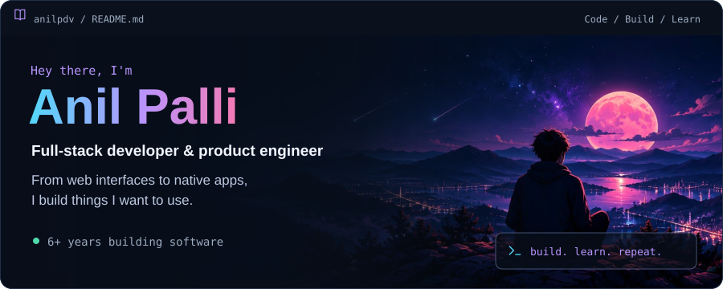
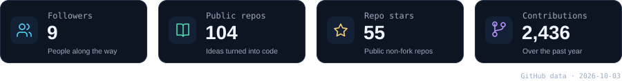
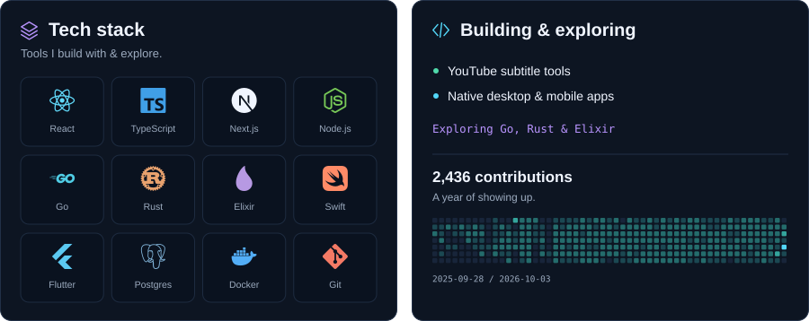
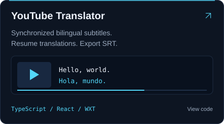
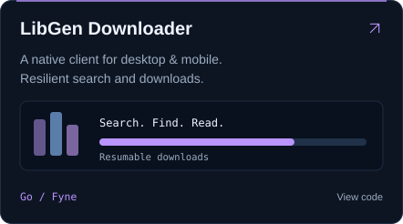
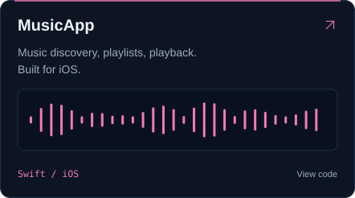
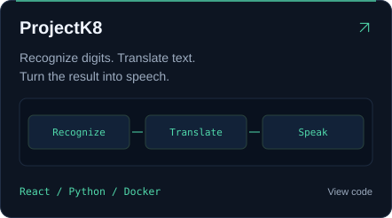

<picture>
  <source media="(max-width: 600px)" srcset="assets/profile/hero-mobile.svg">
  
</picture>

<picture>
  <source media="(max-width: 600px)" srcset="assets/profile/metrics-mobile.svg">
  
</picture>

<picture>
  <source media="(max-width: 600px)" srcset="assets/profile/dashboard-mobile.svg">
  
</picture>

## Selected builds

  <a href="https://github.com/anilpdv/youtube-translator-ext"><picture><source media="(max-width: 600px)" srcset="assets/profile/project-translator-mobile.svg"></picture></a>
  <a href="https://github.com/anilpdv/libgen-gui"><picture><source media="(max-width: 600px)" srcset="assets/profile/project-libgen-mobile.svg"></picture></a>

  <a href="https://github.com/anilpdv/MusicApp"><picture><source media="(max-width: 600px)" srcset="assets/profile/project-music-mobile.svg"></picture></a>
  <a href="https://github.com/anilpdv/projectk8"><picture><source media="(max-width: 600px)" srcset="assets/profile/project-pipeline-mobile.svg"></picture></a>

  Also building <a href="https://github.com/anilpdv/ebook_viewer_project">Ebook Viewer</a> and <a href="https://github.com/anilpdv/quotes-cli">Quotes CLI</a>.

  
  
  
  

<picture>
  <source media="(max-width: 600px)" srcset="assets/profile/footer-mobile.svg">
  
</picture>

Profile in plain text

I'm **Anil Palli**, a self-taught full-stack developer and product engineer with **6+ years of experience**. I build web interfaces, native applications, and developer tools.

My core web stack is **React, TypeScript, Next.js, and Node.js**. I also build with **Go, Swift, and Flutter**, and explore **Rust and Elixir** through side projects.

- [YouTube Translator](https://github.com/anilpdv/youtube-translator-ext): synchronized bilingual subtitles, resumable translation, and SRT export.
- [LibGen Downloader](https://github.com/anilpdv/libgen-gui): a Go/Fyne client for desktop and mobile, with mirror failover and resumable downloads.
- [MusicApp](https://github.com/anilpdv/MusicApp): native iOS music discovery and playback.
- [ProjectK8](https://github.com/anilpdv/projectk8): a containerized digit-recognition, translation, and text-to-speech pipeline.
- [Ebook Viewer](https://github.com/anilpdv/ebook_viewer_project): a Flutter app for PDF and EPUB discovery and reading.
- [Quotes CLI](https://github.com/anilpdv/quotes-cli): search and filter quotes from the terminal.

[Website](https://anilpdv.com) · [LinkedIn](https://www.linkedin.com/in/anil-pdv-090b8a134/) · [Email](mailto:pdvanil42@gmail.com)

The activity panels use GitHub's API and refresh daily. See the [latest data snapshot](assets/profile/data.json).

