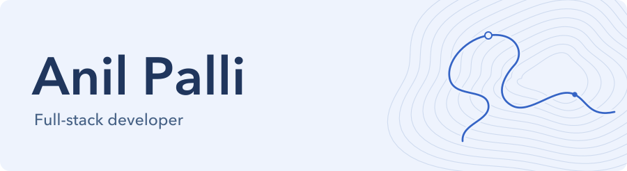

<picture>
  <source media="(max-width: 600px) and (prefers-color-scheme: dark)" srcset="assets/profile-header-mobile-dark.svg">
  <source media="(max-width: 600px)" srcset="assets/profile-header-mobile-light.svg">
  <source media="(prefers-color-scheme: dark)" srcset="assets/profile-header-dark.svg">
  
</picture>

Full-stack developer with **6+ years of experience** building customer portals, education platforms, and multilingual video tools. I care about clear interfaces, maintainable systems, and understanding the problem before choosing the technology.

[Portfolio](https://anilpdv.com) · [Résumé](https://anilpdv.com/resume.pdf) · [LinkedIn](https://linkedin.com/in/anilpdv) · [Email](mailto:pdvanil42@gmail.com)

### Professional work

- **Zumin:** Built a real estate portal with admin, partner, and client workflows, alongside the Next.js website.
- **Day Translations:** Migrated WordPress to headless Next.js and built DayDubs, a multilingual video dubbing application.
- **BYJU’S:** Developed a React coding-education module within a microfrontend platform.

### Selected projects

**[YouTube Subtitle Translator](https://github.com/anilpdv/youtube-translator-ext)**\
A browser extension for synchronized, bilingual subtitles, with resumable translation and SRT export. Built with TypeScript, React, and WXT.

**[UltraNav](https://github.com/anilpdv/UltraNav)**\
An offline cycling computer for Apple Watch Ultra, with GPX navigation and sensor integration. Built with Swift and SwiftUI.

**[LibGen Downloader](https://github.com/anilpdv/libgen-gui)**\
A desktop and mobile book-search client with download management and mirror failover. Built with Go and Fyne.

### Tools I work with

**Core:** React, TypeScript, Next.js, Node.js, React Query, Tailwind CSS.\
**Data & delivery:** PostgreSQL, MongoDB, Docker, Git.\
**Beyond the web:** Go, Swift, Flutter; exploring Rust and Elixir.
